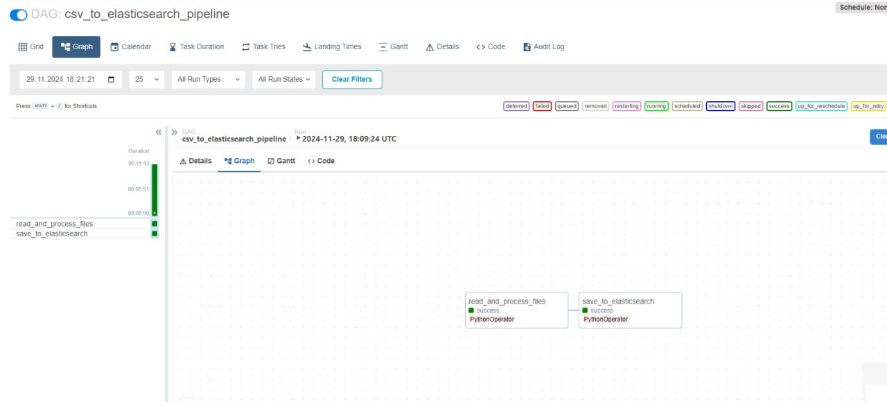
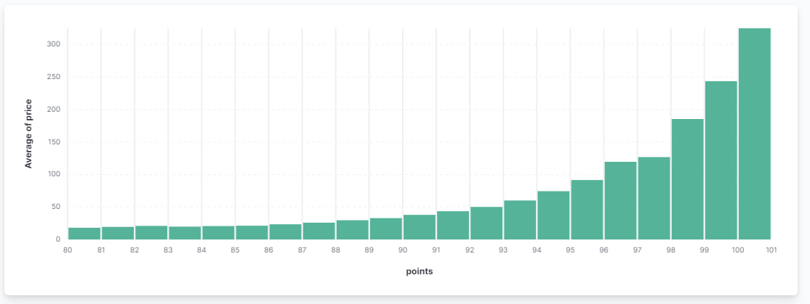
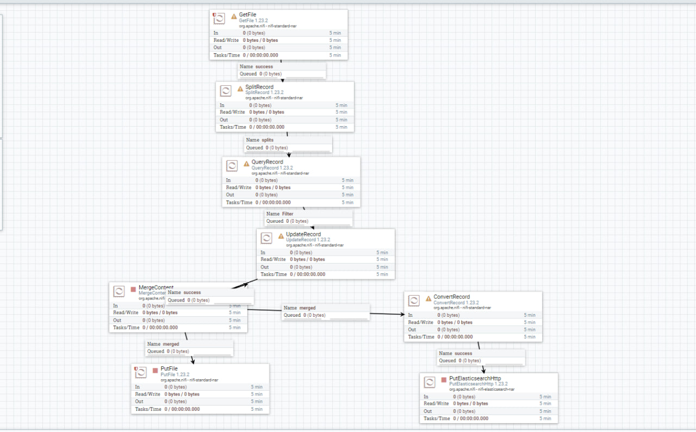

# Кришталь Кирилл Евгеньевич Группа 6231-010402D
# Лабораторная работа №1: Базовый пайплайн работы с данными  

## Часть 1: Реализация пайплайна в Apache Airflow  

### Описание  
Для начала работы реализован **DAG** в Apache Airflow, который автоматизирует базовый пайплайн работы с данными.  

### Этапы пайплайна  
Пайплайн состоит из двух функций:  
1. **Считывание, объединение и фильтрация данных:**  
   - Чтение исходных файлов.  
   - Объединение данных из разных источников.  
   - Фильтрация данных по заданным условиям.  
   - Сохранение результата в итоговый CSV-файл.  

2. **Передача данных в Elasticsearch:**  
   - Отправка подготовленных данных в Elasticsearch для дальнейшего анализа.  

**Код DAG:** доступен в папке `dag`.  

### Запуск DAG  
DAG запускается через веб-интерфейс Apache Airflow.  

**Пример работы DAG:**  
  

---

## Часть 2: Построение гистограммы  

После выполнения пайплайна строится гистограмма, показывающая зависимость стоимости напитка от баллов, поставленных дегустаторами.  

**Гистограмма:**  
  

---

## Часть 3: Реализация пайплайна в Apache NiFi  

### Использование Apache NiFi  
Для альтернативной реализации пайплайна использован **Apache NiFi**, который включает следующие процессоры:  
1. **GetFile:** загрузка данных из исходной директории.  
2. **SplitRecord:** разбиение данных на отдельные записи.  
3. **QueryRecord:** фильтрация данных с помощью SQL-запросов.  
4. **UpdateRecord:** обновление или модификация данных.  
5. **MergeContent:** объединение записей в итоговый файл.  
6. **ConvertRecord:** преобразование данных в нужный формат.  
7. **PutFile:** сохранение результата в выходной файл.  
8. **PutElasticsearchHttp:** отправка данных в Elasticsearch.  

**Шаблон Apache NiFi:**  
  

### Шаблон NiFi  
Файл `.xml`, содержащий разработанный пайплайн, доступен в папке `template`.  

---

